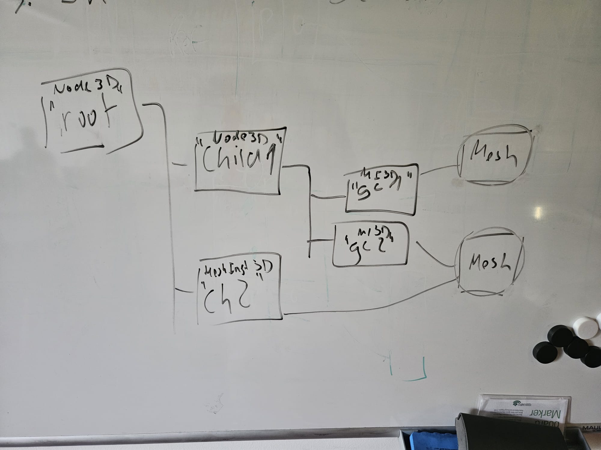

### Tasks für Szenenbaum
1. Objektname für Szenenbaumelemente am Objektspeicher.
2. Add, get, remove-Funktionalität für Kind Liste als public Methoden von Node3D.
3. In main einen Szenenbaum aufbauen nach folgendem Schema:
