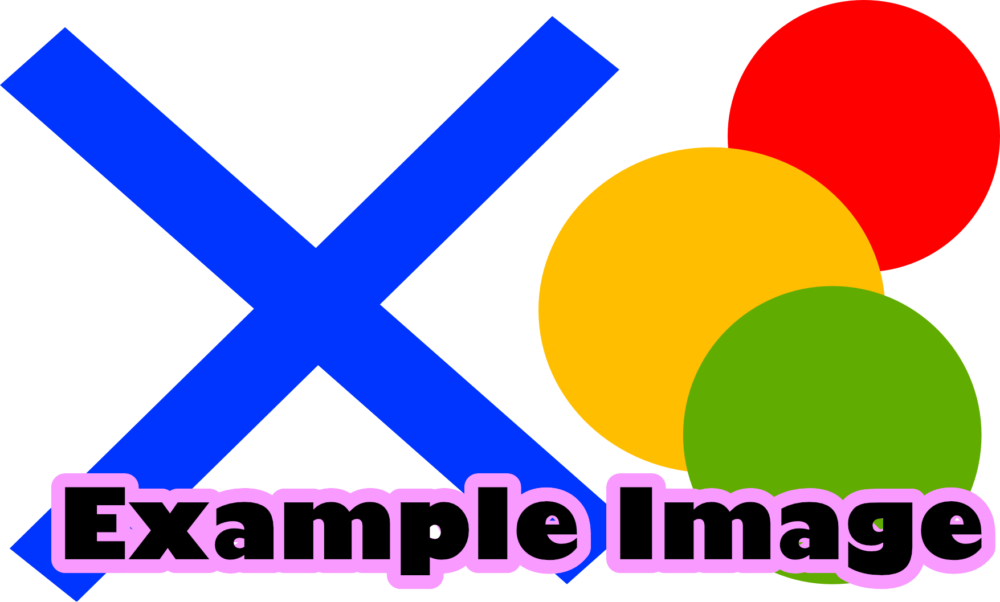

+++
title = 'Hello Code 3'
date = 2024-09-28T15:27:29+02:00
draft = false
weight = 10 
+++

## Goals
Entwicklungsumgebung läuft.
3D-Hello-World in JavaScript/WebGL
Godot installieren, UI kennen lernen

## Assignment

- Install Editor
- Install Add-Ons
- Code something

## Questions

- TBD

## Material
  
  - [Hello Triangle](https://www.xrio.io/)
 
## Insights

- TBD

Example Image: 

